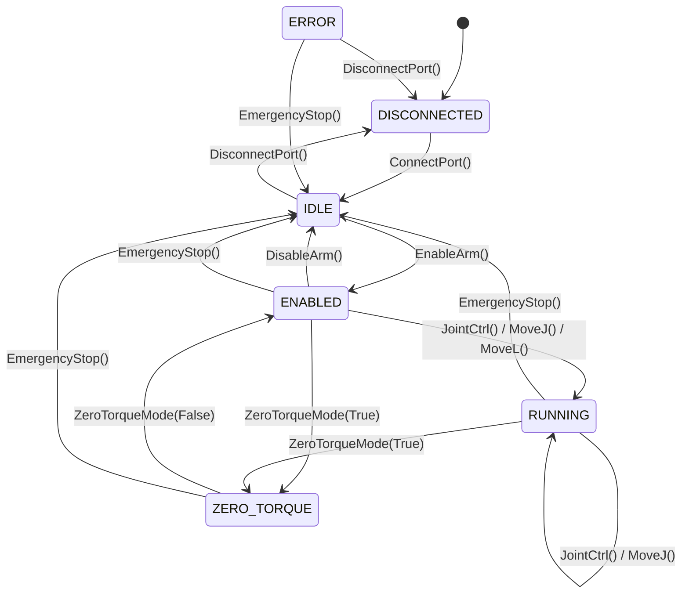

# EL-A3 SDK API 协议说明

> **版本**: 1.0.0 | **协议**: Robstride Private Protocol v1.0 | **日期**: 2026-03-18

---

## 目录

- [1. 概述](#1-概述)
- [2. 协议枚举定义](#2-协议枚举定义)
- [3. 数据结构](#3-数据结构)
- [4. 状态机与生命周期](#4-状态机与生命周期)
- [5. API 参考 — ELA3Interface (CAN 直连)](#5-api-参考--ela3interface-can-直连)
- [6. ArmManager 多臂管理](#6-armmanager-多臂管理)
- [7. 运动学与动力学 (Pinocchio)](#7-运动学与动力学-pinocchio)
- [8. 轨迹规划](#8-轨迹规划)
- [9. CAN 帧协议](#9-can-帧协议)
- [10. 关节配置与限位](#10-关节配置与限位)
- [11. SDK 与 ROS Control 的关系](#11-sdk-与-ros-control-的关系)
- [12. 使用示例](#12-使用示例)

---

## 1. 概述

### 1.1 SDK 定位

`el_a3_sdk` 是 EL-A3 七自由度机械臂（6 臂关节 + L7 夹爪）的 Python 控制库，提供从底层电机通信到高层运动规划的完整 API。SDK 通过 SocketCAN 直接与 Robstride 电机通信，内置 200Hz 高频控制循环。

| 模式 | 类 | 后端 | 适用场景 |
|------|---|------|----------|
| CAN 直连 | `ELA3Interface` | SocketCAN 帧 | 调试、标定、独立控制 |

> **注意**: ROS Control 集成请使用 `el_a3_hardware` 包（C++ ros2_control 插件），不在本 SDK 范围内。

### 1.2 模块结构

```
el_a3_sdk/
├── __init__.py          # 包入口 (v1.0.0)，延迟导入 Pinocchio
├── protocol.py          # 协议枚举、电机参数、关节配置常量
├── data_types.py        # 数据结构（SI 单位: rad, Nm, m）
├── can_driver.py        # SocketCAN 底层驱动（帧收发 + 后台接收线程）
├── interface.py         # ELA3Interface — CAN 直连 API + 200Hz 控制循环
├── arm_manager.py       # ArmManager — 单例多臂管理器
├── kinematics.py        # Pinocchio FK/IK/Jacobian/重力/动力学
├── trajectory.py        # S-curve 七段式 + 三次样条轨迹规划
├── utils.py             # float⇆uint16 映射、单位转换、clamp
└── demo/                # 示例脚本
```

### 1.3 安装

```bash
cd el_a3_sdk
pip install -e .              # 基本安装（CAN 模式）
pip install -e ".[dynamics]"  # 含 Pinocchio 运动学/动力学支持
```

### 1.4 单位约定

SDK 全部使用 SI 单位：

| 物理量 | 单位 | 说明 |
|--------|------|------|
| 角度/位置 | rad | 关节坐标系 |
| 角速度 | rad/s | |
| 力矩 | Nm | |
| 位置 (末端) | m | |
| 温度 | °C | |
| 电压 | V | |
| 电流 | A | |

---

## 2. 协议枚举定义

> 来源: `el_a3_sdk/protocol.py`

### 2.1 CommType — CAN 通信类型

29 位扩展帧 ID 的 Bit28~24 编码。

| 值 | 名称 | 方向 | 说明 |
|----|------|------|------|
| 0 | `GET_DEVICE_ID` | 主→从 | 获取设备 ID 和 64 位 MCU 唯一标识 |
| 1 | `MOTION_CONTROL` | 主→从 | 运控模式指令 (PD + τ_ff) |
| 2 | `FEEDBACK` | 从→主 | 电机反馈 (位置/速度/力矩/温度) |
| 3 | `ENABLE` | 主→从 | 使能电机 |
| 4 | `DISABLE` | 主→从 | 停止电机（Byte[0]=1 时清故障） |
| 6 | `SET_ZERO` | 主→从 | 设置当前位置为零位 |
| 7 | `SET_CAN_ID` | 主→从 | 修改电机 CAN ID |
| 17 | `READ_PARAM` | 双向 | 参数读取（请求 + 应答） |
| 18 | `WRITE_PARAM` | 主→从 | 参数写入（掉电丢失，需 Type 22 保存） |
| 21 | `FAULT_FEEDBACK` | 从→主 | 详细故障码 |
| 22 | `SAVE_PARAMS` | 主→从 | 保存参数到 Flash |
| 23 | `SET_BAUDRATE` | 主→从 | 修改 CAN 波特率（重启生效） |
| 24 | `SET_AUTO_REPORT` | 主→从 | 开启/关闭电机主动上报 |
| 25 | `SET_PROTOCOL` | 主→从 | 切换协议（私有/CANopen/MIT） |
| 26 | `READ_VERSION` | 双向 | 固件版本查询 |

### 2.2 MotorType — 电机型号

| 值 | 型号 | 使用关节 | 峰值力矩 | 速度范围 | 位置范围 | Kp 范围 | Kd 范围 |
|----|------|----------|----------|----------|----------|---------|---------|
| 0 | `RS00` | L1-L3 | ±14 Nm | ±33 rad/s | ±12.57 rad | 0~500 | 0~5 |
| 1 | `EL05` | L4-L7 (配置 A) | ±6 Nm | ±50 rad/s | ±12.57 rad | 0~500 | 0~5 |
| 2 | `RS05` | L4-L7 (配置 B) | ±5.5 Nm | ±50 rad/s | ±12.57 rad | 0~500 | 0~5 |

### 2.3 RunMode — 电机运行模式

| 值 | 名称 | 说明 |
|----|------|------|
| 0 | `MOTION_CONTROL` | 运控模式（PD + 前馈力矩），系统默认 |
| 1 | `POSITION_PP` | 位置模式 PP（梯形速度规划） |
| 2 | `VELOCITY` | 速度模式 |
| 3 | `CURRENT` | 电流模式 |
| 5 | `POSITION_CSP` | 位置模式 CSP（连续位置） |

### 2.4 ArmState — 机械臂状态机

| 值 | 名称 | 说明 |
|----|------|------|
| 0 | `DISCONNECTED` | 未连接 |
| 1 | `IDLE` | 已连接但电机未使能 |
| 2 | `ENABLED` | 电机已使能，可接受运动指令 |
| 3 | `RUNNING` | 正在执行运动 |
| 4 | `ZERO_TORQUE` | 零力矩模式（拖动示教） |
| 5 | `ERROR` | 故障状态 |

### 2.5 ControlMode — 控制模式

| 值 | 名称 | 说明 |
|----|------|------|
| 0x00 | `STANDBY` | 待机 |
| 0x01 | `CAN_COMMAND` | CAN 指令控制 |

### 2.6 MoveMode — 运动模式

| 值 | 名称 | 说明 |
|----|------|------|
| 0x00 | `MOVE_J` | 关节运动（运控模式，PD 控制） |
| 0x01 | `MOVE_CSP` | 连续位置运动 |
| 0x02 | `MOVE_VELOCITY` | 速度运动 |
| 0x03 | `MOVE_CURRENT` | 电流/力矩运动 |
| 0x04 | `MOVE_L` | 直线运动（笛卡尔插值 + IK） |
| 0x05 | `MOVE_C` | 圆弧运动（预留） |

### 2.7 FaultBit — 故障位定义

Type 2 反馈帧 Bit16~21 和 Type 21 详细故障帧。

| 位 | 名称 | 说明 |
|----|------|------|
| 0 | `UNDER_VOLTAGE` | 欠压故障 (< 12V) |
| 1 | `PHASE_CURRENT` | 三相电流故障 |
| 3 | `OVER_VOLTAGE` | 过压故障 (> 60V) |
| 4 | `B_PHASE_OVERCURRENT` | B 相电流采样过流 |
| 5 | `C_PHASE_OVERCURRENT` | C 相电流采样过流 |
| 7 | `ENCODER_UNCALIBRATED` | 编码器未标定 |
| 8 | `HARDWARE_ID` | 硬件识别故障 |
| 9 | `POSITION_INIT` | 位置初始化故障 |
| 14 | `STALL_OVERLOAD` | 堵转过载算法保护 |
| 16 | `A_PHASE_OVERCURRENT` | A 相电流采样过流 |

### 2.8 ParamIndex — 电机参数索引

通信类型 17/18 读写参数时使用。

| 索引 | 名称 | 类型 | 说明 | R/W |
|------|------|------|------|-----|
| 0x7005 | `RUN_MODE` | uint8 | 运行模式 (0=运控, 1=PP, 2=速度, 3=电流, 5=CSP) | R/W |
| 0x7006 | `IQ_REF` | float | 电流模式 Iq 指令 (A) | R/W |
| 0x700A | `SPD_REF` | float | 速度模式速度指令 (rad/s) | R/W |
| 0x700B | `LIMIT_TORQUE` | float | 力矩限制 (Nm) | R/W |
| 0x7010 | `CUR_KP` | float | 电流环 Kp (默认 0.17) | R/W |
| 0x7011 | `CUR_KI` | float | 电流环 Ki (默认 0.012) | R/W |
| 0x7014 | `CUR_FILT_GAIN` | float | 电流滤波系数 (0~1.0, 默认 0.1) | R/W |
| 0x7016 | `LOC_REF` | float | CSP 位置指令 (rad) | R/W |
| 0x7017 | `LIMIT_SPD` | float | CSP 速度上限 (rad/s) | R/W |
| 0x7018 | `LIMIT_CUR` | float | 速度位置模式电流限制 (A) | R/W |
| 0x7019 | `MECH_POS` | float | 负载端计圈机械角度 (rad) | R |
| 0x701A | `IQF` | float | iq 滤波值 (A) | R |
| 0x701B | `MECH_VEL` | float | 负载端转速 (rad/s) | R |
| 0x701C | `VBUS` | float | 母线电压 (V) | R |
| 0x701E | `LOC_KP` | float | 位置环 Kp (默认 40) | R/W |
| 0x701F | `SPD_KP` | float | 速度环 Kp (默认 6) | R/W |
| 0x7020 | `SPD_KI` | float | 速度环 Ki (默认 0.02) | R/W |
| 0x7021 | `SPD_FILT_GAIN` | float | 速度滤波值 (默认 0.1) | R/W |
| 0x7022 | `ACC_RAD` | float | 速度模式加速度 (rad/s², 默认 20) | R/W |
| 0x7024 | `VEL_MAX` | float | PP 模式速度 (rad/s, 默认 10) | R/W |
| 0x7025 | `ACC_SET` | float | PP 模式加速度 (rad/s², 默认 10) | R/W |
| 0x7026 | `EPSCAN_TIME` | uint16 | 上报时间 (1=10ms，递增 5ms) | R/W |
| 0x7028 | `CAN_TIMEOUT` | uint32 | CAN 超时阈值 (20000≈1s，0=禁用) | R/W |
| 0x7029 | `ZERO_STA` | uint8 | 零点标志位 (0=0~2π, 1=-π~π) | R/W |
| 0x702B | `ADD_OFFSET` | float | 零位偏置 (默认 0) | R/W |

---

## 3. 数据结构

> 来源: `el_a3_sdk/data_types.py`。所有数据使用 SI 单位。

### 3.1 MotorFeedback

单个电机反馈数据，来自 Type 2 反馈帧。

| 字段 | 类型 | 单位 | 说明 |
|------|------|------|------|
| `motor_id` | int | — | 电机 ID (1-7) |
| `position` | float | rad | 当前角度（电机坐标系） |
| `velocity` | float | rad/s | 当前角速度 |
| `torque` | float | Nm | 当前力矩 |
| `temperature` | float | °C | 绕组温度 |
| `mode_state` | int | — | 0=Reset, 1=Cali, 2=Motor |
| `fault_code` | int | — | 6 位故障码 |
| `is_valid` | bool | — | 数据是否有效 |
| `timestamp` | float | s | 反馈时间戳 |

### 3.2 ArmJointStates

7 关节状态容器，用于位置、速度或力矩。

| 字段 | 类型 | 单位 | 说明 |
|------|------|------|------|
| `joint_1` ~ `joint_7` | float | rad (或 rad/s, Nm) | 各关节值 |
| `timestamp` | float | s | 时间戳 |
| `hz` | float | Hz | 数据更新频率 |

**方法**:
- `to_list(include_gripper=True) -> List[float]` — 转为列表（6 或 7 元素）
- `from_list(values, timestamp) -> ArmJointStates` — 从列表构造

### 3.3 ArmEndPose

末端执行器位姿。

| 字段 | 类型 | 单位 | 说明 |
|------|------|------|------|
| `x`, `y`, `z` | float | m | 位置 |
| `rx`, `ry`, `rz` | float | rad | 姿态（XYZ 内旋欧拉角） |
| `timestamp` | float | s | 时间戳 |

### 3.4 ArmStatus

机械臂综合状态。

| 字段 | 类型 | 说明 |
|------|------|------|
| `ctrl_mode` | int | 0=Standby, 1=CAN 控制 |
| `arm_status` | int | 0x00=正常, 0x01=未使能, 0x05=异常 |
| `move_mode` | int | 当前运动模式 |
| `motion_status` | int | 0=到达, 1=运动中 |
| `joint_enabled` | List[bool] | 各关节使能状态 |
| `joint_faults` | List[int] | 各关节故障码 |
| `joint_mode_states` | List[int] | 各关节模式状态 |

**属性**: `has_fault: bool`、`all_enabled: bool`

### 3.5 其他数据结构

| 结构 | 说明 | 关键字段 |
|------|------|---------|
| `MotorHighSpdInfo` | 高速反馈 (Type 2) | `speed`, `current`, `position`, `torque` |
| `MotorLowSpdInfo` | 低速反馈 (参数读取) | `voltage`, `motor_temp`, `fault_code` |
| `MotorAngleLimitMaxVel` | 角度限位与速度 | `max_angle_limit`, `min_angle_limit`, `max_joint_spd` |
| `MotorMaxAccLimit` | 最大加速度 | `max_joint_acc` (rad/s²) |
| `ParamReadResult` | 参数读取结果 | `param_index`, `value`, `success` |
| `FirmwareVersion` | 固件版本 | `version_str` (如 "1.2.3.4.5") |
| `DynamicsInfo` | 动力学信息 | `gravity_torques`, `mass_matrix`, `jacobian` |
| `TrajectoryResult` | 轨迹执行结果 | `success`, `error_code`, `actual_positions` |

---

## 4. 状态机与生命周期

### 4.1 状态转换图



### 4.2 各状态允许的操作

| 状态 | 允许的操作 |
|------|-----------|
| `DISCONNECTED` | `ConnectPort()` |
| `IDLE` | `EnableArm()`, `DisconnectPort()` |
| `ENABLED` | `JointCtrl()`, `JointCtrlList()`, `MoveJ()`, `MoveL()`, `EndPoseCtrl()`, `CartesianVelocityCtrl()`, `GripperCtrl()`, `PlanToJointGoal()` (ROS), `ZeroTorqueMode()`, `DisableArm()`, `EmergencyStop()` |
| `RUNNING` | 同 `ENABLED`（持续接受运动指令） |
| `ZERO_TORQUE` | `ZeroTorqueMode(False)`, `EmergencyStop()` |
| `ERROR` | `EmergencyStop()`, `DisconnectPort()` |

### 4.3 状态验证

SDK 在每个运动控制方法调用前自动检查 `arm_state`。若状态不匹配则记录错误日志并返回 `False`，不发送任何指令。

---

## 5. API 参考 — ELA3Interface (CAN 直连)

> 来源: `el_a3_sdk/interface.py`

适用于调试、标定、无 ROS 环境的独立控制。通过 SocketCAN 直接与 Robstride 电机通信。

### 5.1 构造函数

```python
ELA3Interface(
    can_name: str = "can0",
    host_can_id: int = 0xFD,
    motor_type_map: Optional[Dict[int, MotorType]] = None,
    joint_directions: Optional[Dict[int, float]] = None,
    joint_offsets: Optional[Dict[int, float]] = None,
    joint_limits: Optional[Dict[int, tuple]] = None,
    start_sdk_joint_limit: bool = True,
    default_kp: float = 80.0,
    default_kd: float = 4.0,
    urdf_path: Optional[str] = None,
    inertia_config_path: Optional[str] = None,
    logger_level: LogLevel = LogLevel.WARNING,
    control_rate_hz: float = 200.0,
    smoothing_alpha: float = 0.8,
    gravity_feedforward_ratio: float = 1.0,
)
```

| 参数 | 默认值 | 说明 |
|------|--------|------|
| `can_name` | `"can0"` | CAN 接口名 |
| `host_can_id` | `0xFD` (253) | 主机 CAN ID |
| `motor_type_map` | 1-3=RS00, 4-7=EL05 | 电机 ID → 型号映射 |
| `joint_directions` | 见 [10 关节配置](#10-关节配置与限位) | 关节方向（1.0 或 -1.0） |
| `joint_offsets` | 全 0.0 | 关节偏移 (rad) |
| `joint_limits` | 见 [10 关节配置](#10-关节配置与限位) | 关节限位 {id: (lower, upper)} |
| `start_sdk_joint_limit` | `True` | 是否启用 SDK 软限位 |
| `default_kp` | 80.0 | 默认位置增益 |
| `default_kd` | 4.0 | 默认速度增益 |
| `urdf_path` | 自动查找 | URDF 路径（Pinocchio 用） |
| `inertia_config_path` | `None` | 标定惯量参数 YAML |
| `logger_level` | `WARNING` | 日志级别 |
| `control_rate_hz` | 200.0 | 后台控制循环频率 (Hz) |
| `smoothing_alpha` | 0.8 | EMA 位置平滑系数 (0=保持, 1=直通) |
| `gravity_feedforward_ratio` | 1.0 | 重力补偿前馈比例 (0~1) |

### 5.2 连接管理

| 方法 | 签名 | 返回 | 说明 |
|------|------|------|------|
| `ConnectPort` | `() -> bool` | 成功/失败 | 打开 CAN socket，启动收发线程，状态→IDLE |
| `DisconnectPort` | `() -> None` | — | 停止线程，关闭 socket，状态→DISCONNECTED |
| `get_connect_status` | `() -> bool` | 连接状态 | 检查连接有效性 |
| `arm_state` | 属性 `-> ArmState` | 当前状态 | 只读属性 |

### 5.3 电机控制

| 方法 | 签名 | 说明 |
|------|------|------|
| `EnableArm` | `(motor_num=0xFF, run_mode=POSITION_PP, startup_kd=4.0) -> bool` | 使能电机（1-7 单个，0xFF=全部）。按 disable→set_mode→enable→设置 vel_max/acc_set 流程执行。默认 PP 模式，加速度 6 rad/s²，速度 3 rad/s |
| `DisableArm` | `(motor_num=0xFF) -> bool` | 失能电机（1-7 单个，0xFF=全部） |
| `EmergencyStop` | `() -> bool` | 立即失能所有电机并清故障，状态→IDLE |
| `ResetArm` | `() -> bool` | 急停 + 重置内部状态机 |
| `SetZeroPosition` | `(motor_num=0xFF) -> bool` | 设置当前位置为零位（1-7 单个，0xFF=全部） |

### 5.4 模式控制

```python
ModeCtrl(ctrl_mode=0x01, move_mode=0x00, move_spd_rate_ctrl=50) -> None
```

| 参数 | 说明 |
|------|------|
| `ctrl_mode` | 0x00=待机, 0x01=CAN 控制 |
| `move_mode` | 0x00=MOVE_J(运控), 0x01=CSP, 0x02=速度, 0x03=电流 |
| `move_spd_rate_ctrl` | 运动速度百分比 (0-100) |

内部映射: MOVE_J→POSITION_PP, MOVE_CSP→POSITION_CSP, MOVE_VELOCITY→VELOCITY, MOVE_CURRENT→CURRENT。

### 5.5 运动控制

#### JointCtrl — 关节角度控制（PP 位置模式）

```python
JointCtrl(
    joint_1, joint_2, joint_3, joint_4, joint_5, joint_6,  # rad
    kp=None, kd=None, velocity=0.0, torque_ff=None,
) -> bool
```

| 参数 | 类型 | 说明 |
|------|------|------|
| `joint_1` ~ `joint_6` | float | 目标关节角度 (rad)，关节坐标系 |
| `kp` | Optional[float] | 位置增益（None=使用默认值 80.0） |
| `kd` | Optional[float] | 速度增益（None=使用默认值 4.0） |
| `velocity` | float | 速度前馈 (rad/s) |
| `torque_ff` | Optional[List[float]] | 各关节前馈力矩 (Nm)，长度 6 |

每次调用通过 Type 18 写入 loc_ref (0x7016) 设置目标位置，电机内部做梯形速度规划（PP 模式）。

#### JointCtrlList — 列表形式关节控制

```python
JointCtrlList(positions: List[float], **kwargs) -> bool
```

- `positions` 长度 6: 仅控制手臂
- `positions` 长度 7: 手臂 + 夹爪（第 7 个元素自动调用 `GripperCtrl`）

#### GripperCtrl — 夹爪控制

```python
GripperCtrl(
    gripper_angle=0.0, gripper_effort=0.0,
    gripper_enable=True, set_zero=False,
    kp=None, kd=None,
) -> bool
```

| 参数 | 说明 |
|------|------|
| `gripper_angle` | 目标位置 (rad) |
| `gripper_effort` | 前馈力矩 (Nm) |
| `gripper_enable` | False 时失能 L7 电机 |
| `set_zero` | True 时设置 L7 零位 |

#### MoveJ — 关节空间轨迹运动

```python
MoveJ(
    positions: List[float], duration=2.0,
    v_max=None, a_max=None, kp=None, kd=None,
) -> bool
```

内部使用 S-curve 七段式规划器，按 5ms 间隔逐点发送 `JointCtrl`，每个路点附带 Pinocchio 重力前馈。

#### MoveL — 笛卡尔直线运动

```python
MoveL(
    target_pose: ArmEndPose, duration=2.0,
    n_waypoints=50, kp=None, kd=None,
) -> bool
```

笛卡尔空间线性插值 → Pinocchio IK 求解 → 逐点 `JointCtrl` 发送。依赖 Pinocchio。

#### EndPoseCtrl — 末端位姿控制

```python
EndPoseCtrl(
    x, y, z, rx, ry, rz,  # m, rad (XYZ 内旋欧拉角)
    duration=2.0, kp=None, kd=None,
) -> bool
```

Pinocchio IK → MoveJ 轨迹执行。

#### CartesianVelocityCtrl — 笛卡尔速度控制

```python
CartesianVelocityCtrl(
    vx, vy, vz,  # m/s
    wx, wy, wz,  # rad/s
    kp=None, kd=None,
) -> bool
```

实时控制，通过 Jacobian 伪逆映射到关节空间。每次调用步进 20ms。

### 5.6 零力矩模式

#### ZeroTorqueMode — 基础零力矩

```python
ZeroTorqueMode(enable: bool, kd=1.0, gravity_torques=None) -> bool
```

启用时: Kp=0，仅保留阻尼 Kd 和可选重力补偿力矩。状态→ZERO_TORQUE。
关闭时: 恢复位置控制。状态→ENABLED。

#### ZeroTorqueModeWithGravity — 带重力补偿后台线程

```python
ZeroTorqueModeWithGravity(enable: bool, kd=1.0, update_rate=100.0) -> bool
```

启动后台守护线程，以 `update_rate` Hz 持续：读取当前关节角 → Pinocchio RNEA 计算重力力矩 → 发送 Kp=0 + gravity 指令。

#### MasterSlaveConfig — 主从模式

```python
MasterSlaveConfig(mode=0xFC) -> bool
```

- `mode=0xFD`: 主模式（零力矩，可拖动读取）
- `mode=0xFC`: 从模式（恢复正常 PD 控制）

### 5.7 状态查询

| 方法 | 返回类型 | 说明 |
|------|---------|------|
| `GetArmJointMsgs()` | `ArmJointStates` | 7 关节角度 (关节坐标系, rad) |
| `GetArmJointVelocities()` | `ArmJointStates` | 7 关节速度 (rad/s) |
| `GetArmJointEfforts()` | `ArmJointStates` | 7 关节力矩 (Nm) |
| `GetArmEndPoseMsgs()` | `ArmEndPose` | 末端位姿 (Pinocchio FK) |
| `GetArmStatus()` | `ArmStatus` | 综合状态（使能/故障/模式） |
| `GetArmEnableStatus()` | `List[bool]` | 各电机使能状态 |
| `GetArmHighSpdInfoMsgs()` | `List[MotorHighSpdInfo]` | 高速反馈 (速度/位置/力矩) |
| `GetArmLowSpdInfoMsgs()` | `List[MotorLowSpdInfo]` | 低速反馈 (温度/电压) |
| `GetMotorStates()` | `Dict[int, MotorFeedback]` | 原始电机反馈（电机坐标系） |

### 5.8 参数读写

| 方法 | 签名 | 说明 |
|------|------|------|
| `ReadMotorParameter` | `(motor_id, param_index) -> Optional[ParamReadResult]` | 通用参数读取 (Type 17) |
| `WriteMotorParameter` | `(motor_id, param_index, value) -> bool` | 通用参数写入 (Type 18, 掉电丢失) |
| `SearchMotorMaxAngleSpdAccLimit` | `(motor_num, search_content) -> Optional[ParamReadResult]` | 查询速度/加速度限制 |
| `GetCurrentMotorAngleLimitMaxVel` | `() -> List[MotorAngleLimitMaxVel]` | 获取全部电机限位配置 |
| `GetAllMotorMaxAccLimit` | `() -> List[MotorMaxAccLimit]` | 获取全部电机最大加速度 |
| `GetMotorVoltage` | `(motor_id) -> Optional[float]` | 母线电压 (V) |
| `GetFirmwareVersion` | `(motor_id=1) -> Optional[FirmwareVersion]` | 电机固件版本 |
| `GetAllFirmwareVersions` | `() -> Dict[int, FirmwareVersion]` | 全部电机固件版本 |

### 5.9 动力学接口 (Pinocchio)

CAN 和 ROS 模式共用，依赖 Pinocchio，操作 6 个臂关节 (L1-L6)。

| 方法 | 签名 | 返回 | 说明 |
|------|------|------|------|
| `ComputeGravityTorques` | `(positions=None) -> List[float]` | 6 元素列表 (Nm) | RNEA(q, 0, 0) 重力补偿 |
| `GetJacobian` | `(positions=None) -> np.ndarray` | (6, 6) 矩阵 | 末端 Jacobian（世界对齐） |
| `GetMassMatrix` | `(positions=None) -> np.ndarray` | (6, 6) 矩阵 | 惯性矩阵 M(q) |
| `InverseDynamics` | `(q, v, a) -> List[float]` | 6 元素列表 (Nm) | RNEA: (q,v,a)→τ |
| `ForwardDynamics` | `(q, v, tau) -> List[float]` | 6 元素列表 (rad/s²) | ABA: (q,v,τ)→a |
| `GetDynamicsInfo` | `(positions=None) -> DynamicsInfo` | 结构体 | 完整动力学信息 |

`positions` 参数为 `None` 时自动使用当前反馈位置。

### 5.10 辅助方法

| 方法 | 签名 | 说明 |
|------|------|------|
| `SetPositionPD` | `(kp, kd) -> None` | 设置全局默认 PD 增益 |
| `SetJointLimitEnabled` | `(enabled: bool) -> None` | 开关 SDK 软限位保护 |
| `GetCurrentSDKVersion` | `() -> str` | SDK 版本号 |
| `GetCurrentProtocolVersion` | `() -> str` | 协议版本描述 |
| `GetCanFps` | `() -> float` | CAN 帧接收频率 (Hz) |
| `GetCanName` | `() -> str` | CAN 接口名 |

---

---

## 6. ArmManager 多臂管理

> 来源: `el_a3_sdk/arm_manager.py`

Singleton 模式，统一管理不同 CAN 接口的机械臂实例。

### 6.1 基本用法

```python
from el_a3_sdk import ArmManager

mgr = ArmManager()

# 注册 CAN 直连臂
master = mgr.register_can_arm("master", can_name="can0")
slave = mgr.register_can_arm("slave", can_name="can1")

# 获取
arm = mgr.get_arm("master")   # 或 mgr["master"]

# 遍历
for name in mgr.arm_names:
    print(name, mgr[name].arm_state)

# 断开所有
mgr.disconnect_all()
```

### 6.2 API 参考

| 方法 | 签名 | 说明 |
|------|------|------|
| `register_can_arm` | `(name, can_name="can0", **kwargs) -> ELA3Interface` | 注册 CAN 模式臂 |
| `get_arm` | `(name) -> ELA3Interface` | 按名获取（不存在抛 KeyError） |
| `has_arm` | `(name) -> bool` | 检查是否已注册 |
| `unregister` | `(name) -> None` | 注销并断开 |
| `disconnect_all` | `() -> None` | 断开所有臂 |
| `from_config` | `(config_path, auto_connect=False) -> ArmManager` | 从 YAML 批量创建 |
| `reset` | `() -> None` | 销毁 Singleton（仅测试用） |
| `arm_names` | 属性 `-> List[str]` | 已注册臂名列表 |

支持 `name in mgr`、`mgr[name]`、`len(mgr)` 操作。

### 6.3 从配置文件批量创建

```python
mgr = ArmManager.from_config(
    "config/multi_arm_config.yaml",
    auto_connect=True,
)
```

YAML 配置示例:

```yaml
arms:
  arm1:
    enabled: true
    can_interface: can0
    host_can_id: 253
  arm2:
    enabled: true
    can_interface: can1
    host_can_id: 253
```

---

## 7. 运动学与动力学 (Pinocchio)

> 来源: `el_a3_sdk/kinematics.py`

基于 Pinocchio 库，独立于 ROS，CAN 和 ROS 模式共用。操作 6 个臂关节 (L1-L6)，L7 夹爪不参与运动链。

### 7.1 构造函数

```python
ELA3Kinematics(
    urdf_path: Optional[str] = None,         # None=自动查找
    ee_frame_name: str = "end_effector",     # 末端帧名称
    inertia_config_path: Optional[str] = None,
    joint_directions: Optional[Dict[int, float]] = None,
)
```

### 7.2 API 参考

| 方法 | 签名 | 返回 | 说明 |
|------|------|------|------|
| `forward_kinematics` | `(q: List[float]) -> ArmEndPose` | 末端位姿 | FK: 关节角→位姿 |
| `forward_kinematics_se3` | `(q) -> pin.SE3` | SE3 对象 | FK 返回 SE3 |
| `inverse_kinematics` | `(target_pose, q_init=None, max_iter=200, eps=1e-4, dt=0.1, damping=1e-6) -> Optional[List[float]]` | 关节角或 None | DLS 数值 IK |
| `compute_jacobian` | `(q) -> np.ndarray` | (6, nv) | 末端 Jacobian（世界对齐） |
| `compute_gravity` | `(q) -> List[float]` | nv 元素列表 (Nm) | RNEA(q,0,0) 重力补偿 |
| `inverse_dynamics` | `(q, v, a) -> List[float]` | nv 元素列表 (Nm) | RNEA 逆动力学: τ = M(q)a + C(q,v)v + g(q) |
| `forward_dynamics` | `(q, v, tau) -> List[float]` | nv 元素列表 (rad/s²) | ABA 正动力学: a = M⁻¹(τ - Cv - g) |
| `mass_matrix` | `(q) -> np.ndarray` | (nv, nv) | CRBA 惯性矩阵 M(q) |
| `coriolis_matrix` | `(q, v) -> np.ndarray` | (nv, nv) | 科氏力矩阵 C(q,v) |

**属性**: `model`, `data`, `nq`, `nv`

### 7.3 惯量标定

通过 `inertia_config_path` 加载 YAML 标定参数，覆盖 URDF 中 L2-L6 的质量和质心：

```yaml
use_calibrated_params: true
inertia_params:
  L2:
    mass: 1.05
    com: [0.0, -0.12, 0.0]
  L3:
    mass: 0.85
    com: [0.0, 0.0, -0.08]
```

---

## 8. 轨迹规划

> 来源: `el_a3_sdk/trajectory.py`。无 ROS 依赖。

### 8.1 TrajectoryPoint

```python
@dataclass
class TrajectoryPoint:
    time: float                    # 时间 (s)
    positions: List[float]         # 关节位置 (rad)
    velocities: List[float]        # 关节速度 (rad/s)
    accelerations: List[float]     # 关节加速度 (rad/s²)
```

### 8.2 SCurvePlanner — 单关节 S-curve

标准七段式 S-curve 速度剖面规划。

```python
planner = SCurvePlanner(v_max=3.0, a_max=10.0, j_max=50.0)
profile = planner.plan(start=0.0, end=1.5)
pos, vel, acc = planner.evaluate(profile, t=0.5)
points = planner.generate_trajectory(profile, dt=0.005)
```

| 方法 | 签名 | 说明 |
|------|------|------|
| `plan` | `(start, end, v_max=None, a_max=None, j_max=None) -> SCurveProfile` | 计算剖面 |
| `evaluate` | `(prof, t) -> Tuple[float, float, float]` | 在时刻 t 求值 (pos, vel, acc) |
| `generate_trajectory` | `(prof, dt=0.005) -> List[TrajectoryPoint]` | 生成采样轨迹 |

**SCurveProfile 七段**: t1(加加速) → t2(匀加速) → t3(减加速) → t4(匀速) → t5(加减速) → t6(匀减速) → t7(减减速)

### 8.3 MultiJointPlanner — 多关节同步

所有关节在相同时间内完成运动，自动缩放速度/加速度以保持比例协调。

```python
mp = MultiJointPlanner(n_joints=6, v_max=3.0, a_max=10.0)
profiles = mp.plan_sync(starts=[0]*6, ends=[0.5, 1.0, -0.5, 0, 0, 0])
traj = mp.generate_trajectory(profiles, dt=0.005)
```

| 方法 | 签名 | 说明 |
|------|------|------|
| `plan_sync` | `(starts, ends, v_max=None, a_max=None) -> List[SCurveProfile]` | 同步规划 |
| `generate_trajectory` | `(profiles, dt=0.005) -> List[TrajectoryPoint]` | 合并为多关节轨迹 |

### 8.4 CubicSplinePlanner — 三次样条

多路点 Hermite 三次样条插值。

```python
waypoints = [[0]*6, [0.5, 1.0, -0.5, 0, 0, 0], [0]*6]
traj = CubicSplinePlanner.plan_waypoints(waypoints, durations=[2.0, 2.0], dt=0.005)
```

| 方法 | 签名 | 说明 |
|------|------|------|
| `plan_waypoints` | `(waypoints, durations, dt=0.005) -> List[TrajectoryPoint]` | 多路点样条规划 |

---

## 9. CAN 帧协议

> 详细协议参考 [`电机通信协议汇总.md`](../../电机通信协议汇总.md)

### 9.1 29 位扩展帧 ID 编码

```
Bit 28~24: 通信类型 (CommType, 5 bits)
Bit 23~8:  数据区2 (16 bits) — 主机 CAN ID 或前馈力矩编码
Bit  7~0:  目标地址 (8 bits) — 电机 CAN ID
```

默认主机 CAN ID: `0xFD` (253)。电机 CAN ID: 1~7。

### 9.2 运控模式帧 (Type 1)

发送运控指令，电机执行 PD + 前馈力矩控制:

```
τ = Kp × (θ_target - θ_actual) + Kd × (ω_target - ω_actual) + τ_ff
```

**帧 ID**: CommType=1, DataArea2=τ_ff 编码 (uint16), Target=motor_id

**数据域 (8 bytes, 大端序)**:

| 字节 | 内容 | 映射范围 |
|------|------|----------|
| Byte 0-1 | 目标位置 (uint16) | 0~65535 → P_MIN~P_MAX (±12.57 rad) |
| Byte 2-3 | 目标速度 (uint16) | 0~65535 → V_MIN~V_MAX (电机型号相关) |
| Byte 4-5 | Kp (uint16) | 0~65535 → 0~500 (或 0~5000) |
| Byte 6-7 | Kd (uint16) | 0~65535 → 0~5 (或 0~100) |

**帧 ID 数据区 2**: τ_ff (uint16) → T_MIN~T_MAX (电机型号相关)

### 9.3 反馈帧 (Type 2)

电机反馈帧，每次收到 Type 1/3/4/6 后自动回复。

**数据域 (8 bytes, 大端序)**:

| 字节 | 内容 | 映射范围 |
|------|------|----------|
| Byte 0-1 | 当前位置 (uint16) | 0~65535 → P_MIN~P_MAX |
| Byte 2-3 | 当前速度 (uint16) | 0~65535 → V_MIN~V_MAX |
| Byte 4-5 | 当前力矩 (uint16) | 0~65535 → T_MIN~T_MAX |
| Byte 6-7 | 温度 (uint16) | Temp(°C) × 10 |

**帧 ID 位域**:

| 位 | 内容 |
|----|------|
| Bit 22~23 | 模式状态: 0=Reset, 1=Cali, 2=Motor |
| Bit 16~21 | 故障码 (6 bits) |
| Bit 8~15 | 电机 CAN ID |

### 9.4 参数读写帧 (Type 17/18)

**读取请求 (Type 17)**:

| 字节 | 内容 |
|------|------|
| Byte 0-1 | 参数索引 (小端序) |
| Byte 2-7 | 保留 (0) |

**写入 (Type 18)**:

| 字节 | 内容 |
|------|------|
| Byte 0-1 | 参数索引 (小端序) |
| Byte 2-3 | 保留 (0) |
| Byte 4-7 | 参数值 (IEEE-754 float, 小端序) |

### 9.5 uint16 线性映射公式

```python
# 编码 (发送)
uint16 = (value - min) * 65535 / (max - min)

# 解码 (接收)
value = uint16 * (max - min) / 65535 + min
```

```python
# SDK 实现 (el_a3_sdk/utils.py)
def float_to_uint16(x, x_min, x_max):
    x = max(x_min, min(x_max, x))
    return int((x - x_min) * 65535.0 / (x_max - x_min))

def uint16_to_float(x_int, x_min, x_max):
    return x_int * (x_max - x_min) / 65535.0 + x_min
```

### 9.6 各型号映射范围汇总

| 电机 | P_MIN/MAX (rad) | V_MIN/MAX (rad/s) | T_MIN/MAX (Nm) | KP_MAX | KD_MAX |
|------|-----------------|--------------------|--------------------|--------|--------|
| RS00 | ±12.57 | ±33 | ±14 | 500 | 5 |
| EL05 | ±12.57 | ±50 | ±6 | 500 | 5 |
| RS05 | ±12.57 | ±50 | ±5.5 | 500 | 5 |

---

## 10. 关节配置与限位

### 10.1 默认关节映射

L4-L7 默认使用 EL05，可通过 `motor_type_map` 参数或 `wrist_motor_type` 切换为 RS05。

| 关节 | 电机 ID | 默认型号 | 方向 | 偏移 (rad) | 限位下界 (rad) | 限位上界 (rad) | 限位角度 |
|------|---------|---------|------|-----------|---------------|---------------|---------|
| L1 | 1 | RS00 | -1 | 0.0 | -2.79253 | +2.79253 | ±160° |
| L2 | 2 | RS00 | +1 | 0.0 | 0.0 | +3.66519 | 0°~210° |
| L3 | 3 | RS00 | -1 | 0.0 | -4.01426 | 0.0 | -230°~0° |
| L4 | 4 | EL05 | +1 | 0.0 | -1.5708 | +1.5708 | ±90° |
| L5 | 5 | EL05 | -1 | 0.0 | -1.5708 | +1.5708 | ±90° |
| L6 | 6 | EL05 | +1 | 0.0 | -1.5708 | +1.5708 | ±90° |
| L7 (夹爪) | 7 | EL05 | +1 | 0.0 | -1.5708 | +1.5708 | ±90° |

### 10.2 关节方向说明

`direction` 系数用于关节坐标系与电机坐标系之间的转换：

```
motor_position = joint_position × direction + offset
joint_position = (motor_position - offset) × direction
```

### 10.3 EL05 vs RS05 参数差异

| 参数 | EL05 | RS05 |
|------|------|------|
| 峰值力矩 | 6.0 Nm | 5.5 Nm |
| 额定力矩 | 1.8 Nm | 1.6 Nm |
| 减速比 | 9:1 | 7.75:1 |
| 最大电流 | 10 Apk | 11 Apk |
| 力矩映射范围 | ±6 Nm | ±5.5 Nm |

### 10.4 软限位保护

SDK 默认启用软限位保护（`start_sdk_joint_limit=True`）。所有运动指令发送前自动 clamp 到限位范围内。可通过 `SetJointLimitEnabled(False)` 关闭。

---

## 11. SDK 与 ROS Control 的关系

本 SDK (`el_a3_sdk`) 通过 SocketCAN 直接与 Robstride 电机通信，适用于无 ROS 环境的独立控制、调试和标定。

ROS2 环境下应使用 `el_a3_hardware` 包（C++ ros2_control 插件），它直接通过 CAN 总线控制电机，不依赖本 SDK。两者共享相同的底层 CAN 协议和 Pinocchio 动力学模型。

| 场景 | 推荐方案 | 说明 |
|------|---------|------|
| 独立调试、标定、Demo | `el_a3_sdk` (Python) | 无需 ROS，pip install 即可使用 |
| MoveIt 运动规划 | `el_a3_hardware` (C++ ros2_control) | 通过 ros2_control 接口集成 |
| Xbox 遥操作 | `el_a3_teleop` (ROS2 节点) | 通过 ros2_control JointTrajectoryController |
| 主从拖动示教 | `el_a3_sdk` ArmManager | 双臂独立 CAN 通信，低延迟 |

> 注: 旧版 Web UI SDK Bridge 已移至独立项目，不包含在本仓库中。

---

## 12. 使用示例

### 12.1 CAN 模式快速上手

```python
from el_a3_sdk import ELA3Interface

arm = ELA3Interface(can_name="can0")
arm.ConnectPort()
arm.EnableArm()

# 关节控制
arm.JointCtrl(0.0, 1.57, -0.78, 0.0, 0.0, 0.0)

# 查询反馈
joints = arm.GetArmJointMsgs()
print(f"关节角度: {joints.to_list()}")

# 夹爪控制
arm.GripperCtrl(gripper_angle=0.5)

# 轨迹运动
arm.MoveJ([0.0, 0.5, -0.5, 0.0, 0.0, 0.0], duration=2.0)

arm.DisableArm()
arm.DisconnectPort()
```

### 12.2 多臂管理

```python
from el_a3_sdk import ArmManager

mgr = ArmManager()

# 注册双臂（不同 CAN 接口）
master = mgr.register_can_arm("master", can_name="can0")
slave = mgr.register_can_arm("slave", can_name="can1")

master.ConnectPort()
slave.ConnectPort()
master.EnableArm()
slave.EnableArm()

# 主臂拖动示教
master.ZeroTorqueMode(True)

# 读取主臂关节 → 发送到从臂
import time
while True:
    q = master.GetArmJointMsgs().to_list(include_gripper=False)
    slave.JointCtrlList(q)
    time.sleep(0.02)
```

### 12.3 零力矩拖动示教

```python
from el_a3_sdk import ELA3Interface

arm = ELA3Interface(can_name="can0")
arm.ConnectPort()
arm.EnableArm()

# 基础零力矩（无重力补偿）
arm.ZeroTorqueMode(True, kd=1.0)

# 带 Pinocchio 重力补偿的零力矩
arm.ZeroTorqueModeWithGravity(True, kd=1.0, update_rate=100.0)

# 拖动过程中读取关节角度
import time
for _ in range(500):
    q = arm.GetArmJointMsgs()
    print(f"[{q.timestamp:.3f}] {q.to_list()}")
    time.sleep(0.01)

# 关闭
arm.ZeroTorqueModeWithGravity(False)
arm.DisableArm()
arm.DisconnectPort()
```

### 12.4 RS05 电机配置

```python
from el_a3_sdk import ELA3Interface, MotorType

arm = ELA3Interface(
    can_name="can0",
    motor_type_map={
        1: MotorType.RS00, 2: MotorType.RS00, 3: MotorType.RS00,
        4: MotorType.RS05, 5: MotorType.RS05, 6: MotorType.RS05, 7: MotorType.RS05,
    },
)
```

### 12.5 动力学计算

```python
from el_a3_sdk import ELA3Interface

arm = ELA3Interface(can_name="can0")
arm.ConnectPort()
arm.EnableArm()

# 重力补偿力矩
tau_g = arm.ComputeGravityTorques()
print(f"重力力矩: {tau_g}")

# Jacobian
J = arm.GetJacobian()
print(f"Jacobian shape: {J.shape}")

# 惯性矩阵
M = arm.GetMassMatrix()
print(f"Mass matrix: {M.shape}")

# 完整动力学
info = arm.GetDynamicsInfo()
print(f"gravity: {info.gravity_torques}")
```

---

## 附录: 版本历史

| 版本 | 日期 | 变更 |
|------|------|------|
| 0.4.0 | 2026-03 | 纯 CAN SDK、ArmManager、Pinocchio 动力学、200Hz 控制循环 |
| 1.0.0 | 2026-03-18 | 修复 ArmStatus 越界、速度编码范围、线程安全；逐关节 PD；SLERP 姿态插值；Context Manager；MoveWaypoints；SaveParameters |

---

**关联文档**:
- [README.md](../README.md) — SDK 总览与快速开始
- [电机通信协议汇总.md](./电机通信协议汇总.md) — 底层 CAN 协议详细说明（私有/CANopen/MIT）
- [el_a3_ros README](../../el_a3_ros/README.md) — ROS2 控制系统文档
- [ROS 接口参考](../../el_a3_ros/ROS_INTERFACE_REFERENCE.md) — ROS Topic / Action / Service 列表
